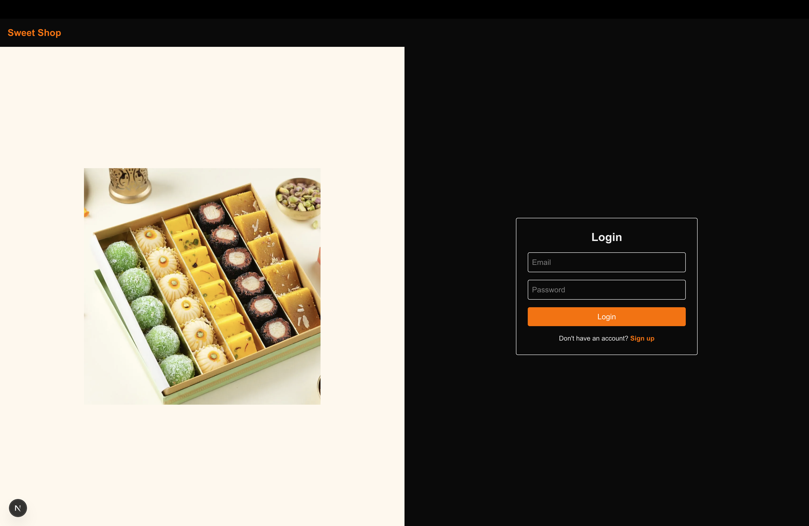
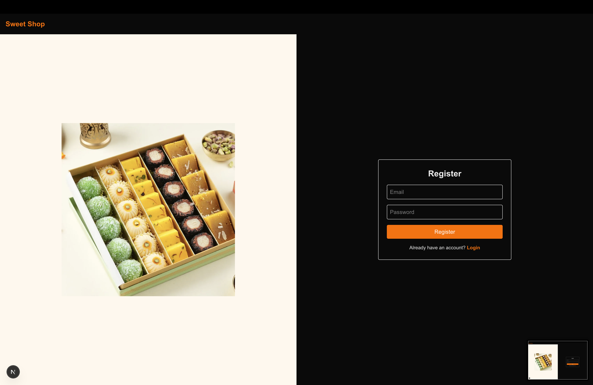
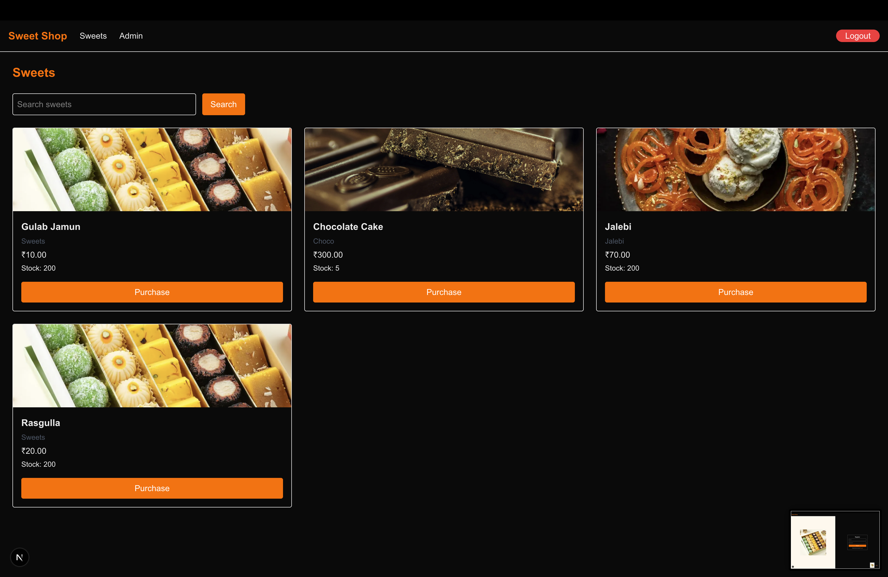
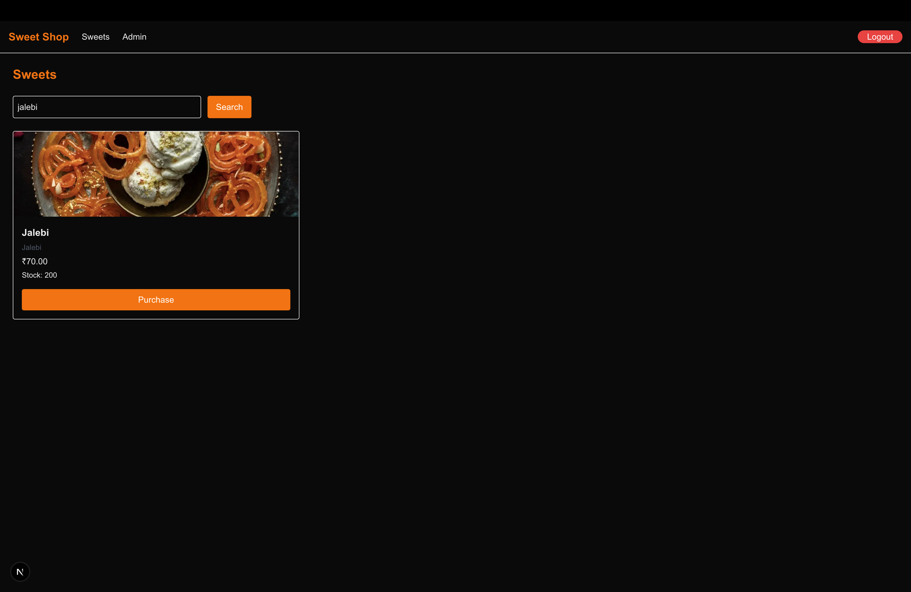
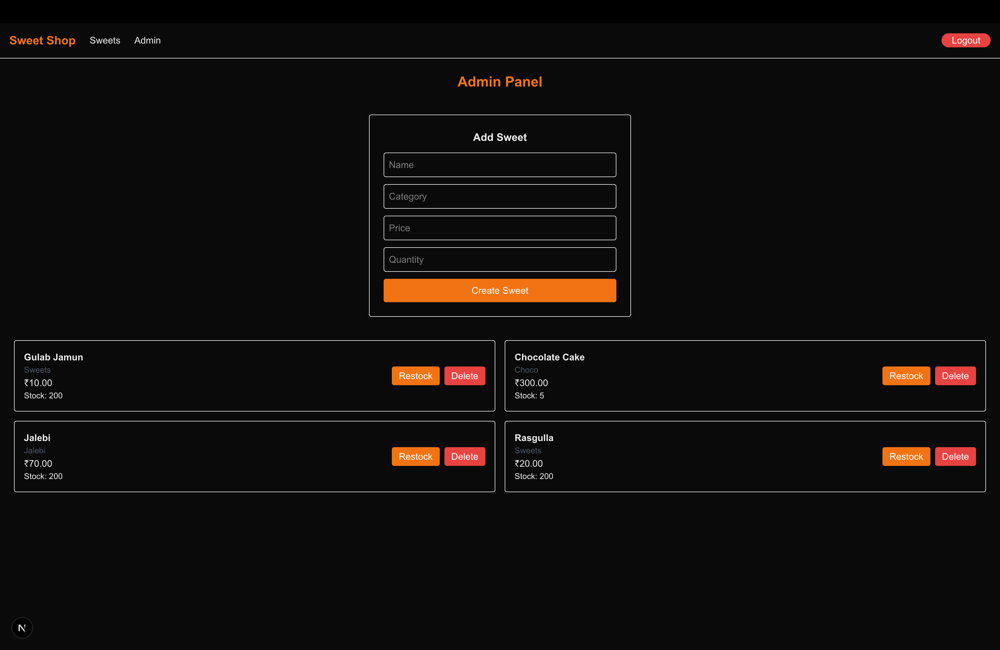
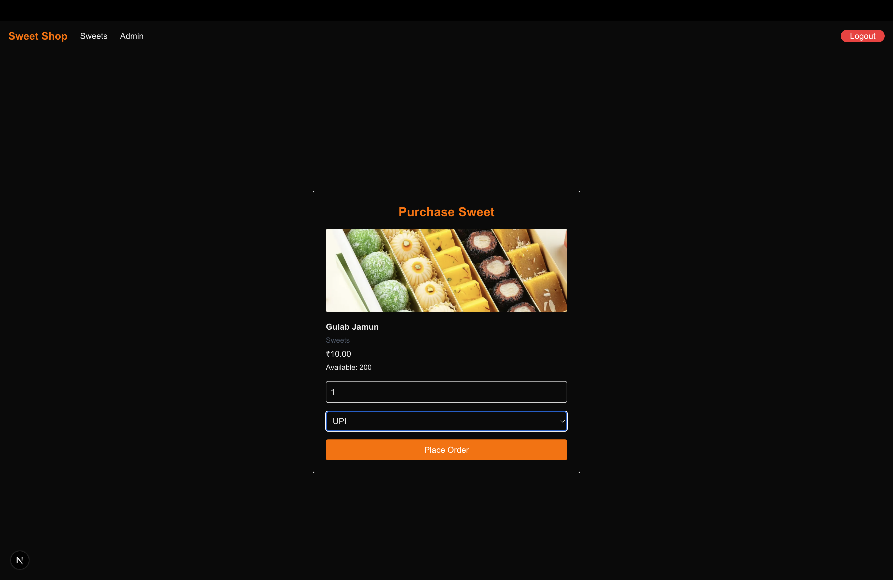

<!-- PROJECT SCREENSHOTS -->

<p align="center">
  
</p>

<p align="center">
  
</p>

<p align="center">
  
</p>

<p align="center">
  
</p>

<p align="center">
  
</p>

<p align="center">
  
</p>

---

# 🍬 Sweet Shop Management System

The **Sweet Shop Management System** is a full-stack web application built as part of the **AI Kata / TDD Kata assessment**.  
The project demonstrates backend API development, database integration, frontend SPA design, authentication, role-based access control, inventory management, and responsible AI usage in modern software development.

---

## 🎯 Objective

The objective of this project is to design and build a **robust, production-ready Sweet Shop Management System** that allows:

- Users to register, log in, browse, search, and purchase sweets
- Admin users to manage sweets and inventory
- Secure API access using token-based authentication
- Clean architecture and modern development workflows

This project follows the **requirements and guidelines defined in the AI Kata PRD** :contentReference[oaicite:0]{index=0}.

---

## 🚀 Features

### 🔐 Authentication & Authorization
- User registration and login
- JWT-based authentication
- Role-based access control:
  - **USER** → browse & purchase sweets
  - **ADMIN** → manage sweets & inventory

### 🍭 Sweets Management
- View all available sweets
- Search sweets by name
- Display category, price, and stock
- Image support with default fallback

### 🛒 Purchase Flow
- Dedicated purchase page per sweet
- Quantity selection
- Payment method selection (UI-level)
- Stock validation
- Order confirmation via alert

### 🧑‍💼 Admin Panel
- Add new sweets
- Delete sweets
- Restock inventory
- Admin-only access using guard logic

### 🎨 UI & UX
- Responsive, modern SPA
- Built with Tailwind CSS
- Consistent color system:
  - **Orange** → primary actions
  - **Red** → destructive actions
- Clean, minimal, and accessible design

---

## 🛠️ Tech Stack

### Frontend
- **Next.js (App Router)**
- **TypeScript**
- **Tailwind CSS**
- Client-side routing & guards

### Backend
- **Node.js**
- **Express.js**
- **TypeScript**
- **JWT Authentication**

### Database
- **PostgreSQL**
- **Neon Serverless Database**
- **Drizzle ORM**
- Atomic updates (Neon-compatible, no transactions)

## 🗂️ Project Structure
```sweet-shop/
├── backend/
│ ├── src/
│ │ ├── routes/
│ │ ├── controllers/
│ │ ├── db/
│ │ ├── middleware/
│ │ └── server.ts
│ └── drizzle/
│
├── frontend/
│ ├── app/
│ │ ├── login/
│ │ ├── register/
│ │ ├── sweets/
│ │ ├── purchase/[id]/
│ │ └── admin/
│ ├── components/
│ └── lib/
│
├── screenshots/
└── README.md
```

## Backend Setup
```cd backend
npm install
```

## Create a .env file:
```DATABASE_URL=your_neon_database_url
JWT_SECRET=your_jwt_secret
PORT=4000
```

## Run database migrations:
```npm run db:push```

## Start the backend server:
```npm run dev```

## Backend runs at:
```http://localhost:4000```

## Frontend Setup
```cd frontend
npm install
npm run dev
```

## Frontend runs at:
```http://localhost:3000```


## Admin Account Setup

After registering a user, promote them to admin directly in the database:
UPDATE users SET role = 'ADMIN' WHERE email = 'admin@email.com';

## Application Flow
```/                  → Redirects to /login
/login             → User login
/register          → User registration
/sweets            → Browse & search sweets
/purchase/:id      → Purchase a sweet
/admin             → Admin panel (ADMIN only)
```

## My AI Usage

```AI tools were used responsibly and transparently during development.```

## Tools Used

```ChatGPT```

## How AI Was Used

-- Architectural planning and API design discussions
-- Debugging runtime and integration issues
-- Refining UI/UX consistency
-- Assistance with error resolution (Neon + Drizzle constraints)
-- Improving code readability and structure

## Reflection

-- AI significantly improved productivity by accelerating problem-solving and providing architectural guidance.
-- All AI-generated suggestions were reviewed, adapted, and validated manually.
-- The final implementation reflects my own understanding and decision-making, with AI acting as a supportive development tool.

## Deliverables Checklist

✅ Full-stack working application
✅ RESTful backend with authentication
✅ Database integration (PostgreSQL)
✅ Modern SPA frontend
✅ Screenshots of final application
✅ AI usage disclosure
✅ Clean and readable codebase

## Author

```Prince Kumar Mishra
B.E. Computer Science
Full-Stack Developer (Aspiring)
```
